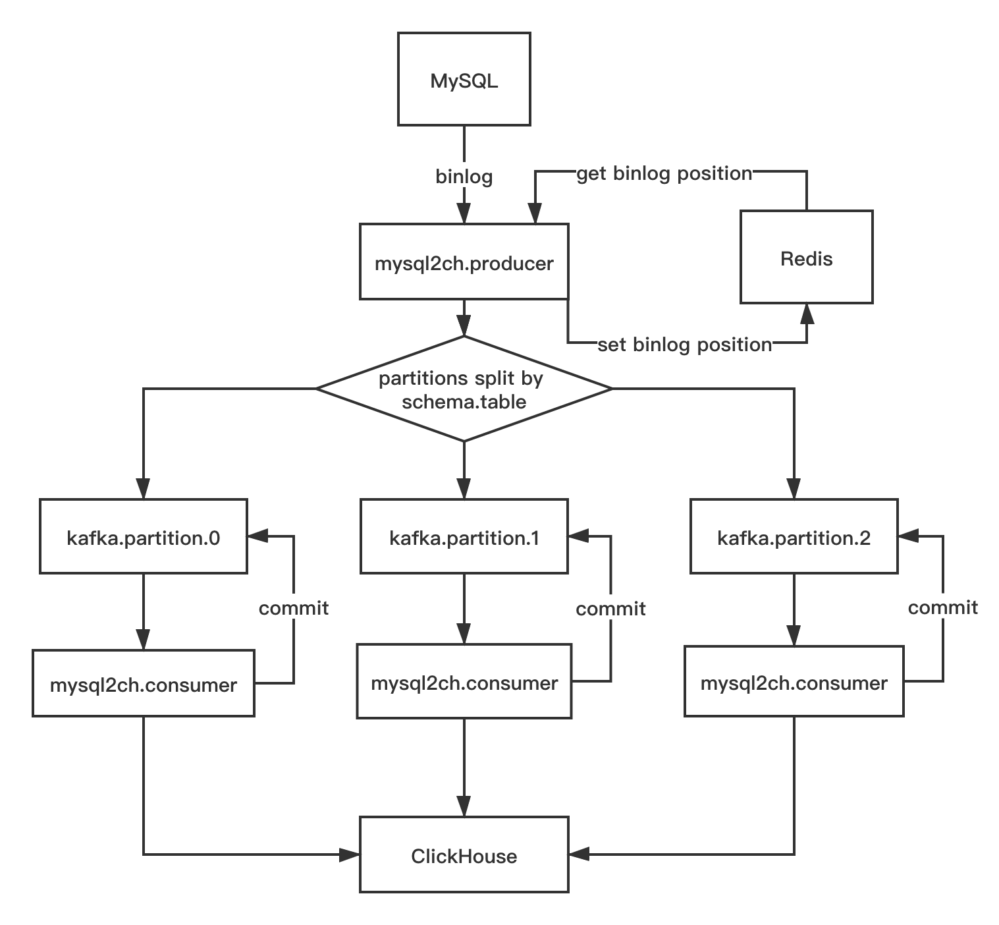

# mysql2ch


## Introduction

mysql2ch is used to sync data from MySQL to ClickHouse.



## Requirements

* [kafka]( https://kafka.apache.org/ )
* docker & docker-compose

## Usage

1. ``cp .env.example .env`` and edit it.
2. edit ``docker-compose.yml``,which will read ``.env``,add your own consumer.One consumer consume one kafka partition.
3. ``docker-compose up -d``.

## Optional

* [sentry]( https://github.com/getsentry/sentry ),error reporting,worked if set ``SENTRY_DSN`` in ``.env``.

## Example

```dotenv
# if True,will display sql information
DEBUG=True
# sentry need
ENVIRONMENT=development

MYSQL_HOST=127.0.0.1
MYSQL_PORT=3306
MYSQL_USER=root
MYSQL_PASSWORD=123456
MYSQL_SERVER_ID=101

REDIS_HOST=127.0.0.1
REDIS_PORT=6379
REDIS_DB=0

CLICKHOUSE_HOST=127.0.0.1
CLICKHOUSE_PORT=9002
CLICKHOUSE_PASSWORD=
CLICKHOUSE_USER=default

SENTRY_DSN=https://3450e192063d47aea7b9733d3d52585f@sentry.test.com/1

KAFKA_SERVER=127.0.0.1:9092
KAFKA_TOPIC=mysql2ch

# only these schemas to replication,multiple split with comma.
SCHEMAS=test
# only these tables to replication,multiple split with comma.
TABLES=test

# kafka partitions mapping,which means binlog of test.test will produce to 0 partition.
PARTITIONS=test.test=0;test.test2=1;

# init binlog file and position,should set first,after will read from redis.
INIT_BINLOG_FILE=binlog.000474
INIT_BINLOG_POS=155

# how many num to submit
INSERT_NUMS=20000
# how many seconds to submit
INSERT_INTERVAL=60
```